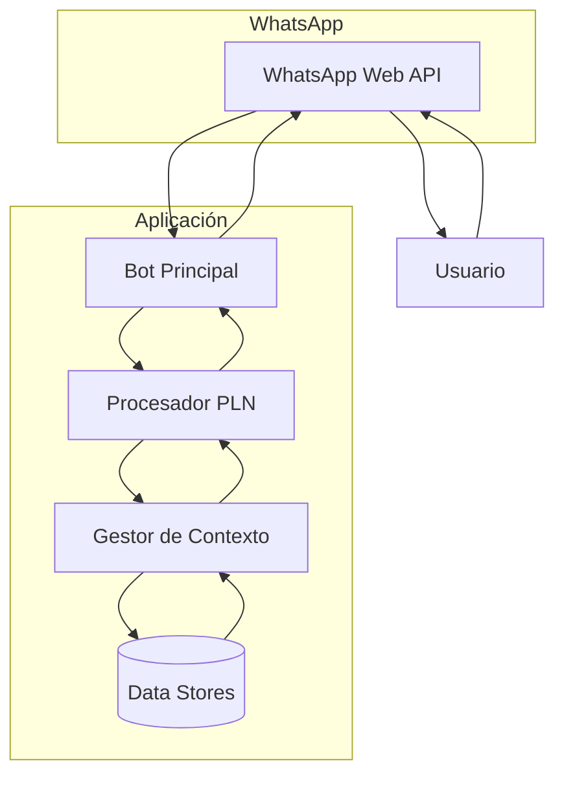

# 🤖 Chatbot Académico con PLN: NeuroWeb

NeuroWeb es un servicio automatizado que permite la inscripción y atención a estudiantes interesados en formarse en Inteligencia Artificial, Ciencia de Datos y Desarrollo Web a través de WhatsApp.


## 🌟 Características Principales

- **Menú interactivo** de cursos académicos
- **Proceso de inscripción** guiado con validación de datos
- **Información detallada** sobre horarios, costos y requisitos
- **Conexión con asesores** cuando se requiere
- **Reconocimiento flexible** de lenguaje natural
- **Persistencia de contexto** durante conversaciones

## 🔄 Flujo de Procesamiento

1. **Recepción de Mensaje**: El bot recibe mensajes a través de WhatsApp Web
2. **Preprocesamiento**: Normalización de texto (minúsculas, sin acentos)
3. **Clasificación de Intención**: Búsqueda de coincidencias en el corpus
4. **Manejo de contexto conversacional**
5. **Generación de Respuesta**:
   - Recuperación de información específica sobre los cursos
   - Construcción de mensajes personalizados según el contexto
6. **Persistencia de Datos**:
   - Registro de conversaciones
   - Almacenamiento de inscripciones a los cursos de NeuroWeb

# 📦 Estructura del Proyecto

```text
chatbot-academico/
├── assets/               # Multimedia del bot
├── data/
│   ├── corpus/           # Intenciones y respuestas
│   ├── sessions/         # Sesiones de WhatsApp
│   ├── contacts.log      # Registro de contactos
│   └── inscriptions.log  # Inscripciones realizadas
├── src/
│   ├── services/
│   │   ├── whatsapp/     # Conexión con WhatsApp
│   │   └── nlp/          # Procesamiento de lenguaje
└── config.json           # Configuración inicial

```

## 🛠️ Arquitectura Técnica

### Diagrama de Componentes


🚀 Instalación y Configuración
Clona el repositorio:
```
git clone https://github.com/tu-usuario/chatbot-academico.git
cd chatbot-academico
```
Instala dependencias:
```
npm install
```
## ▶️ Ejecución
```
npm start
```
## 🛠️ Dependencias Principales
| Paquete           | Función                      |
|-------------------|------------------------------|
| whatsapp-web.js    | Conexión con WhatsApp        |
| string-similarity  | Comparación de similitud de texto |
| fs-extra          | Manejo de archivos            |
| qrcode-terminal    | Generación de QR en terminal |

## 📌 Requisitos del Sistema
- **Node.js v16+
- **NPM v8+
- **WhatsApp activo en dispositivo móvil
- **Navegador Chromium instalado


