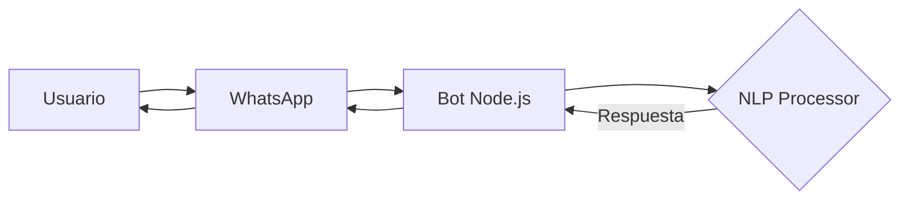

# Chatbot Académico con PLN

Bot de WhatsApp para atención automática con procesamiento de lenguaje natural.

## 🚀 Instalación
```bash
git clone https://github.com/tu-usuario/chatbot-academico.git
cd chatbot-academico
npm install
```

## ⚙️ Configuración
1. Añade números autorizados en `config.json`
2. Coloca tu imagen promocional en `assets/promo.jpg`
3. Edita el corpus en `data/corpus.json`

## ▶️ Ejecución
```bash
npm start
```

## 🧠 Arquitectura


## 📌 Requisitos
- Node.js v16+
- WhatsApp en tu teléfono para escanear QR